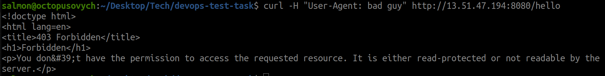
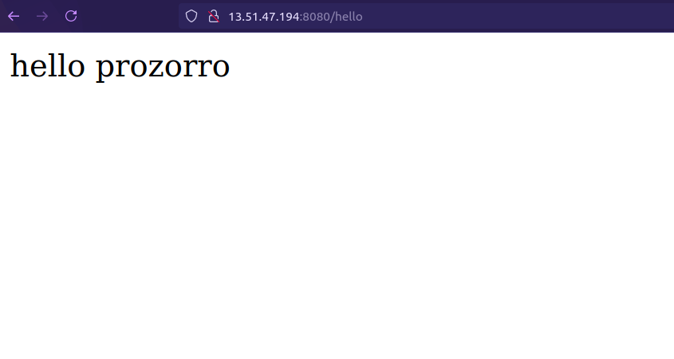

# devops-test-task

This guide provides step-by-step instructions on how to deploy a Python application using Terraform and Ansible on an AWS EC2 instance.

## Prerequisites

1. **AWS Account**: Ensure you have an AWS account.
2. **AWS CLI**: Install and configure AWS CLI with the necessary permissions.
3. **Terraform**: Install Terraform from [Terraform Installation Guide](https://learn.hashicorp.com/tutorials/terraform/install-cli).
4. **Ansible**: Install Ansible from [Ansible Installation Guide](https://docs.ansible.com/ansible/latest/installation_guide/intro_installation.html).
5. **SSH Key Pair**: Create an SSH key pair locally or in the AWS Management Console and download the `.pem` file.

## Step 1: Deploy Infrastructure with Terraform

1. **Create Terraform Configuration**: Refer to `main.tf` file to define your AWS infrastructure, including security groups and EC2 instances.

2. **Initialize Terraform**: Run the following command to initialize your Terraform configuration.

    ```bash
    terraform init
    ```
3. **Review changes**: Run the following command to review changes to the infrastructure.
     ```bash
    terraform plan
    ```
4. **Apply Terraform Configuration**: Apply the configuration to create the infrastructure.

    ```bash
    terraform apply
    ```

    Confirm the action by typing `yes` when prompted.

5. **Retrieve Public IP**: Note the public IP address of the EC2 instance from the Terraform output.

## Step 2: Configure and Deploy the Application with Ansible

1. **Create Ansible Playbook**: Write an Ansible playbook to install Nginx, Python, and the application on the EC2 instance.

2. **Configure Ansible Hosts**: Create an `hosts` file with the public IP of your EC2 instance.

    ```ini
    [web]
    <server-name> <public-ip-address> ansible_user=ec2-user ansible_ssh_private_key_file=/path/to/your-key-name.pem
    ```

3. **Run Ansible Playbook**: Run the Ansible playbook to configure the instance and deploy the application.

    ```bash
    ansible-playbook -i hosts ansible/playbook.yml
    ```

## Step 3: Test the Deployment

1. **Access the Application**: Open a web browser and navigate to `http://<public-ip-address>:8080/hello`. You should see the message "hello prozorro".

2. **Test User-Agent Restriction**:
    - Use a tool like `curl` to test the User-Agent restriction.

    ```bash
    curl -H "User-Agent: bad guy" http://<public-ip-address>/hello
    ```

    - You should receive a `403 Forbidden` response.



    ```bash
    curl http://<public-ip-address>:8080/hello
    ```

- You should see the message "hello prozorro".



## Cleanup

To clean up the resources created by Terraform, run:

```bash
terraform destroy
```

## Areas for Improvement

1.  **Terraform Modular Approach**:
    
    *   Refactoring Terraform configuration into reusable modules to improve organization and reusability.
        
2.  **Terraform Cloud for Remote Runs**:
    
    *   Using Terraform Cloud to manage Terraform state remotely and enable collaboration on infrastructure changes.
        
3.  **Ansible Roles**:
    
    *   Structuring Ansible playbook using roles to promote reusability and better organization.
        
4.  **Jinja2 Templates**:
    
    *   Using Jinja2 templates in Ansible to dynamically generate configuration files based on variables.
        
5.  **WSGI for Python Application**:
    
    *   Using a WSGI server like Gunicorn to serve a Python application for better performance and scalability.

